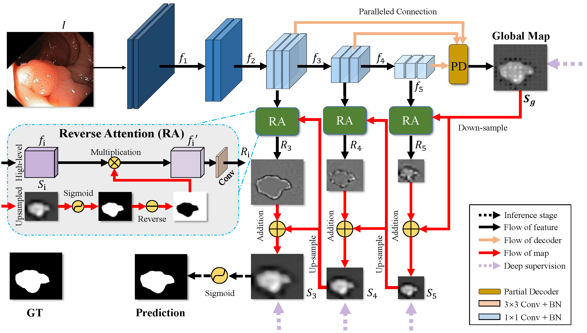
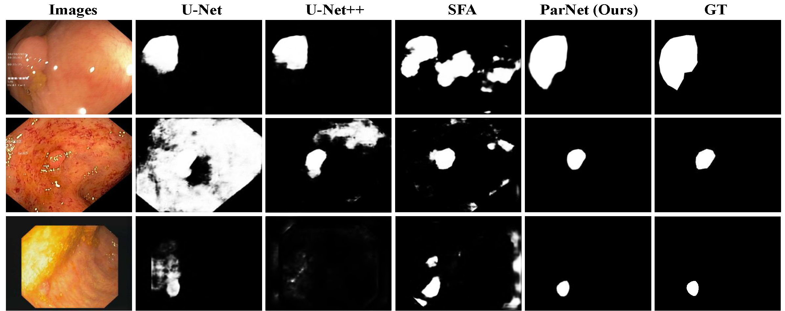

# PraNet: Parallel Reverse Attention Network for Polyp Segmentation (MICCAI2020-Oral)

> **Authors:** 
> [Deng-Ping Fan](https://dpfan.net/), 
> [Ge-Peng Ji](https://scholar.google.com/citations?user=oaxKYKUAAAAJ&hl=en), 
> [Tao Zhou](https://taozh2017.github.io/),
> [Geng Chen](https://www.researchgate.net/profile/Geng_Chen13), 
> [Huazhu Fu](http://hzfu.github.io/), 
> [Jianbing Shen](http://iitlab.bit.edu.cn/mcislab/~shenjianbing), and 
> [Ling Shao](http://www.inceptioniai.org/).

## 1. Preface

- This repository provides code for "_**PraNet: Parallel Reverse Attention Network for Polyp Segmentation**_" MICCAI-2020. 
([arXiv Pre-print]())

- If you have any questions about our paper, feel free to contact me. And if you are using PraNet 
or evaluation toolbox for your research, please cite this paper ([BibTeX](#4-citation)).

### 1.1. :fire: NEWS :fire:
- [2020/09/18] :boom: Upload the pre-computed maps.

- [2020/05/28] :boom: Upload pre-trained weights. (Updated by Ge-Peng Ji)

- [2020/06/24] :boom: Release training/testing code. (Updated by Ge-Peng Ji)

- [2020/03/24] Create repository.

### 1.2. Table of Contents

- [PraNet: Parallel Reverse Attention Network for Polyp Segmentation (MICCAI 2020)](#pranet--parallel-reverse-attention-network-for-polyp-segmentation--miccai-2020-)
  * [1. Preface](#1-preface)
    + [1.1. :fire: NEWS :fire:](#11--fire--news--fire-)
    + [1.2. Table of Contents](#12-table-of-contents)
  * [2. Overview](#2-overview)
    + [2.1. Introduction](#21-introduction)
    + [2.2. Framework Overview](#22-framework-overview)
    + [2.3. Qualitative Results](#23-qualitative-results)
  * [3. Proposed Baseline](#3-proposed-baseline)
    + [3.1 Training/Testing](#31-training-testing)
    + [3.2 Evaluating your trained model:](#32-evaluating-your-trained-model-)
    + [3.3 Pre-computed maps:](#33-pre-computed-maps)
  * [4. Citation](#4-citation)
  * [5. TODO LIST](#5-todo-list)
  * [6. FAQ](#6-faq)

<small><i><a href='http://ecotrust-canada.github.io/markdown-toc/'>Table of contents generated with markdown-toc</a></i></small>

  

## 2. Overview

### 2.1. Introduction

Colonoscopy is an effective technique for detecting colorectal polyps, which are highly related to colorectal cancer. 
In clinical practice, segmenting polyps from colonoscopy images is of great importance since it provides valuable 
information for diagnosis and surgery. However, accurate polyp segmentation is a challenging task, for two major reasons:
(i) the same type of polyps has a diversity of size, color and texture; and
(ii) the boundary between a polyp and its surrounding mucosa is not sharp. 

To address these challenges, we propose a parallel reverse attention network (PraNet) for accurate polyp segmentation in colonoscopy
images. Specifically, we first aggregate the features in high-level layers using a parallel partial decoder (PPD). 
Based on the combined feature, we then generate a global map as the initial guidance area for the following components. 
In addition, we mine the boundary cues using a reverse attention (RA) module, which is able to establish the relationship between
areas and boundary cues. Thanks to the recurrent cooperation mechanism between areas and boundaries, 
our PraNet is capable of calibrating any misaligned predictions, improving the segmentation accuracy. 

Quantitative and qualitative evaluations on five challenging datasets across six
metrics show that our PraNet improves the segmentation accuracy significantly, and presents a number of advantages in terms of generalizability,
and real-time segmentation efficiency (∼50fps).

### 2.2. Framework Overview

      
    <em> 
    Figure 1: Overview of the proposed PraNet, which consists of three reverse attention 
    modules with a parallel partial decoder connection. See § 2 in the paper for details.
    </em>

### 2.3. Qualitative Results

      
    <em> 
    Figure 2: Qualitative Results.
    </em>

## 3. Proposed Baseline

### 3.1. Training/Testing

The training and testing experiments are conducted using [PyTorch](https://github.com/pytorch/pytorch) with 
a single GeForce RTX TITAN GPU of 24 GB Memory.

> Note that our model also supports low memory GPU, which means you can lower the batch size

1. Configuring your environment (Prerequisites):
   
    Note that PraNet is only tested on Ubuntu OS with the following environments. 
    It may work on other operating systems as well but we do not guarantee that it will.
    
    + Creating a virtual environment in terminal: `conda create -n SINet python=3.6`.
    
    + Installing necessary packages: PyTorch 1.1

1. Downloading necessary data:

    + downloading testing dataset and move it into `./data/TestDataset/`, 
    which can be found in this [download link (Google Drive)](https://drive.google.com/file/d/1o8OfBvYE6K-EpDyvzsmMPndnUMwb540R/view?usp=sharing).
    
    + downloading training dataset and move it into `./data/TrainDataset/`, 
    which can be found in this [download link (Google Drive)](https://drive.google.com/file/d/1lODorfB33jbd-im-qrtUgWnZXxB94F55/view?usp=sharing).
    
    + downloading pretrained weights and move it into `snapshots/PraNet_Res2Net/PraNet-19.pth`, 
    which can be found in this [download link (Google Drive)](https://drive.google.com/file/d/1pUE99SUQHTLxS9rabLGe_XTDwfS6wXEw/view?usp=sharing).
    
    + downloading Res2Net weights [download link (Google Drive)](https://drive.google.com/file/d/1_1N-cx1UpRQo7Ybsjno1PAg4KE1T9e5J/view?usp=sharing).
   
1. Training Configuration:

    + Assigning your costumed path, like `--train_save` and `--train_path` in `MyTrain.py`.
    
    + Just enjoy it!

1. Testing Configuration:

    + After you download all the pre-trained model and testing dataset, just run `MyTest.py` to generate the final prediction map: 
    replace your trained model directory (`--pth_path`).
    
    + Just enjoy it!

### 3.2 Evaluating your trained model:

One-key evaluation is written in MATLAB code ([link](https://drive.google.com/file/d/1_h4_CjD5GKEf7B1MRuzye97H0MXf2GE9/view?usp=sharing)), 
please follow this the instructions in `./eval/main.m` and just run it to generate the evaluation results in `./res/`.
The complete evaluation toolbox (including data, map, eval code, and res): [link](https://drive.google.com/file/d/1qga1UJlIQdHNlt_F9TdN4lmmOH4gN7l2/view?usp=sharing). 

### 3.3 Pre-computed maps: 
They can be found in [download link](https://drive.google.com/file/d/1tW0OOxPSuhfSbMijaMPwRDPElW1qQywz/view?usp=sharing).

## 4. Citation

Please cite our paper if you find the work useful: 

    @article{fan2020pra,
    title={PraNet: Parallel Reverse Attention Network for Polyp Segmentation},
    author={Fan, Deng-Ping and Ji, Ge-Peng and Zhou, Tao and Chen, Geng and Fu, Huazhu and Shen, Jianbing and Shao, Ling},
    journal={MICCAI},
    year={2020}
    }

## 5. TODO LIST

> If you want to improve the usability or any piece of advice, please feel free to contact me directly ([E-mail](gepengai.ji@gmail.com)).

- [ ] Support `NVIDIA APEX` training.

- [ ] Support different backbones (
VGGNet, 
ResNet, 
[ResNeXt](https://github.com/facebookresearch/ResNeXt),
[iResNet](https://github.com/iduta/iresnet), 
and 
[ResNeSt](https://github.com/zhanghang1989/ResNeSt) 
etc.)

- [ ] Support distributed training.

- [ ] Support lightweight architecture and real-time inference, like MobileNet, SqueezeNet.

- [ ] Support distributed training

- [ ] Add more comprehensive competitors.

## 6. FAQ

1. If the image cannot be loaded in the page (mostly in the domestic network situations).

    [Solution Link](https://blog.csdn.net/weixin_42128813/article/details/102915578)

---

**[⬆ back to top](#0-preface)**
